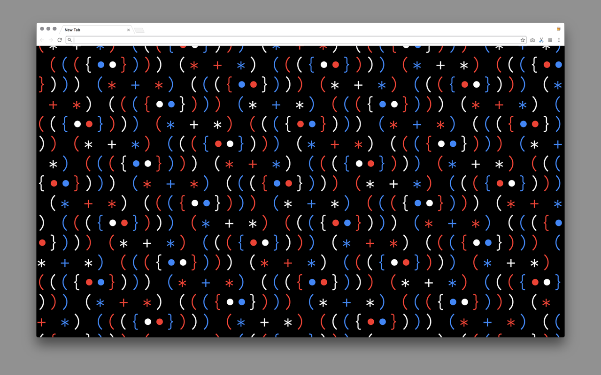

Unicode Patterns
==============

#### Replace new tab page with generated Unicode text patterns

[Install Extension for Chrome](https://chrome.google.com/webstore/detail/unicode-patterns/kpojnenkeikgfiadhgbbnmdkginfeioa)

[Install AddOn for Firefox](https://addons.mozilla.org/de/firefox/addon/unicode-patterns/)

Build
-------------

| Command | Description |
|-|-|
| `$ npm run dev`   | Spin up Webpack watch task and development server ([0.0.0.0:1112](http://0.0.0.0:1112)) |
| `$ npm run build` | Compile (and uglify) necessary files into .zip (Chrome) and .zip (Firefox) |
| `$ npm run build:chrome` | Compile (and uglify) necessary files into .zip only for Chrome |
| `$ npm run build:firefox` | Compile (and uglify) necessary files into .zip only for Firefox |

Issues, Bugs, TODOs
-------------

All TODOs, features, and bugs are tracked within [issues](https://github.com/frederickk/unicode-patterns/issues/).

License
-------------

[MIT License](LICENSE)

This extension also uses a few typeface/icon assets.

- [Evolvent](https://github.com/evolventa/evolventa) © 2016 by Alex I. Kuznetsov. GPLv2 and LPPL.  
- [IBM Plex Mono](https://www.ibm.com/plex/) Copyright © 2017 IBM Corp. with Reserved Font Name "Plex"
- [Material Design Icons](https://google.github.io/material-design-icons/) Copyright Google Inc. Apache License Version 2.0
- [Space Mono](https://fonts.google.com/specimen/Space+Mono) Copyright 2016 Google Inc. All Rights Reserved.
- [Unscii](http://pelulamu.net/unscii/) Viznut GPL
